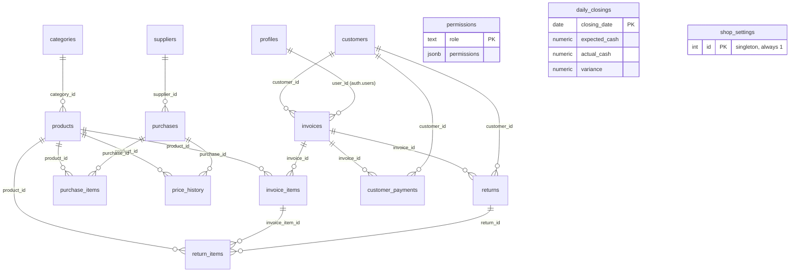

# Documentation

## 01. Backend choice

**Supabase** (hosted Postgres + Auth + Storage + Edge Functions), talked to directly from the browser — no separate application server.

Why: the app needs relational data with real foreign-key integrity (invoices → items → products → stock, customers → credit balances, purchases → cost history) and multi-row operations that must succeed or fail together (receiving a purchase touches stock *and* cost *and* a history log in one go). A plain document/NoSQL BaaS would push that consistency logic into the client, which is exactly the kind of place it goes wrong under concurrent use. Postgres gives real transactions and constraints; Supabase gives that Postgres a REST/RPC layer, auth, file storage, and row-level security on top of it, without standing up and hosting a server myself.

## 02. Full schema

Full column-by-column reference (types, nullability, defaults, every foreign key and its delete rule) lives in **[DATA_MODEL.md](./DATA_MODEL.md)** — generated from the live schema, not hand-written, so it can't drift from what's actually deployed.

Entity relationships:



Fourteen business tables plus `profiles`/`permissions` for auth. `daily_closings` and `shop_settings` stand alone (no inbound FKs) — the first is a computed daily snapshot, the second is a single settings row.

## 03. Services used

| Service | What it's for |
|---|---|
| **Postgres** (16 tables) | All business data. See §02. |
| **Auth** | Email/password login. A `handle_new_user` trigger creates the matching `profiles` row on signup. |
| **Row Level Security** | Every table. Enforced by role (`Admin`/`Manager`/`Cashier`/`Warehouse`) via a `current_role()` helper — see §04. |
| **Storage** — bucket `shop-assets` (public read) | Shop logo upload, from Settings → Shop Info. Write/delete restricted to `Admin`. |
| **Edge Function** — `admin-users` | Create/delete a user, reset a password. Needs the service-role key, so it runs server-side only; verifies the caller is `Admin` (via their `profiles` row) before touching `auth.admin.*`. |
| **20 Postgres RPC functions** | Every multi-table or aggregate operation — see §04 for why, and DATA_MODEL.md for the full list with signatures. |

## 04. Advanced feature verification

**Advanced feature: Row Level Security, role-scoped.** Every table has RLS enabled; policies check a `current_role()` helper against the caller's `profiles.role`. Anything that mutates money or stock across multiple tables (receiving a purchase, processing a return, recording a payment, closing the day) is a `SECURITY DEFINER` Postgres function with its own role check, so the enforcement can't be bypassed by calling the tables directly with a permissive-looking policy.

**How I verified the boundary — real queries against the live database, not a read of the policy text.** Set up two demo accounts (§06: `user@ex.com` = Admin, `admin@gmail.com` = Cashier) and ran queries as each, using Postgres session variables to simulate their JWT (`set local role authenticated; set local request.jwt.claim.sub = '<their user id>'`) so RLS evaluates exactly as it would for a real logged-in request.

| Test | As | Result |
|---|---|---|
| Call `receive_purchase()`, an Admin/Warehouse-only function | Cashier | Rejected: `"not authorized"` |
| `select count(*) from suppliers` (Admin/Warehouse-only table) | Cashier | `0` rows visible |
| Same query | Admin | `1` row visible (RLS correctly scopes by role, not just hiding UI) |
| `update profiles set role = 'Admin' where id = auth.uid()` (self-escalation attempt) | Cashier | Silently reverted — role read back as `"Cashier"` immediately after |

The self-escalation test matters most: RLS is row-level, not column-level, so a policy alone can't stop someone updating *their own* profile row and just changing the `role` column inside it. That's closed by a `BEFORE UPDATE` trigger that strips any role change made by a non-Admin, tested above by attempting it and reading the value back rather than trusting the trigger exists.

## 05. Setup from zero

1. Create a Supabase project. Note the project ref and anon key.
2. Copy `.env.example` to `.env` and fill in `VITE_SUPABASE_URL` / `VITE_SUPABASE_ANON_KEY`.
3. Install the Supabase CLI (or just use `npx supabase`, no install needed) and link this repo to your project:
   ```
   npx supabase login --token <your personal access token>
   npx supabase link --project-ref <your project ref>
   ```
4. Provision the whole schema in one command:
   ```
   npm run db:setup
   ```
   This runs every file in `supabase/*.sql` against your project, in the order they depend on each other (base tables → RLS → invoices/customers → purchase → returns → daily closing → analytics → settings/storage).
5. Deploy the Edge Function:
   ```
   npx supabase functions deploy admin-users
   ```
6. Create at least one `Admin` profile for your own account (there's no in-app first-run setup flow):
   ```sql
   update public.profiles set role = 'Admin' where id = '<your auth user id>';
   ```
7. Install and run:
   ```
   npm install
   npm run dev
   ```

## 06. A way in

**Seed demo data** (idempotent — safe to run again, it detects its own data and skips):
```
npm run seed
```
Adds 6 products, 2 customers, and 11 invoices spread over the last 11 days, so Dashboard/Analytics graphs and the Billing/Customer history views have real numbers immediately.

**Test credentials** — already seeded into this project, verified working against the live Auth endpoint (not just created and assumed to work):

| Email | Password | Role | What it shows |
|---|---|---|---|
| `user@ex.com` | `DemoPass123!` | Admin | Full access — every page, Settings, user management. |
| `admin@gmail.com` | `cc!` | Cashier | Restricted view — no Inventory/Purchase/Settings/Analytics, matching §04's boundary test. |

These are existing accounts repurposed for demo access, not freshly created. To rotate a password yourself:
```sql
update auth.users set encrypted_password = crypt('<new password>', gen_salt('bf'))
where email = 'user@ex.com';
```
Or delete/disable the users from the Auth section of the Supabase dashboard.
